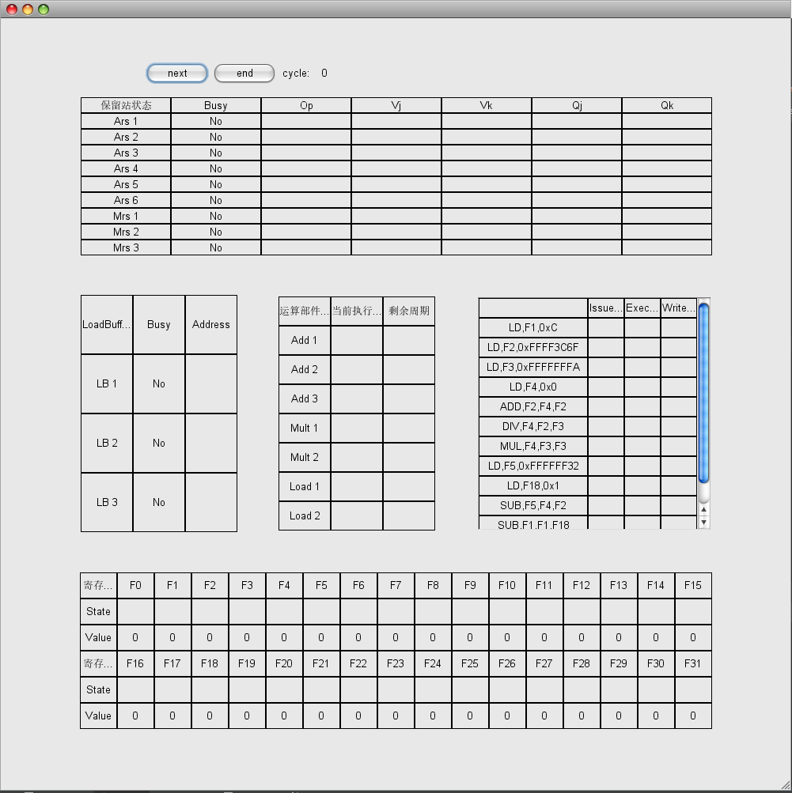
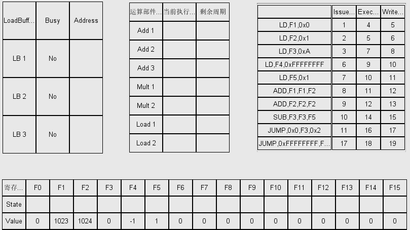

## Tomasulo算法模拟器设计与分析实验

计63 黄冰鉴 2016011296

2019/6/9

---


### 概述

本次实验中我基于PPT上的算法讲解和助教给出的例子，使用Java实现了Tomasulo算法模拟器，并通过和例子的对比验证了实现的正确性。除此之外，我还使用Java JFrame实现了美观的图形化交互界面，支持多种操作。另外我还设计了样例小程序，从寄存器结果验证了模拟器正确性。


### 项目编译&运行

本项目使用intelliJ IDEA搭建，引入了额外的依赖库`quaqua.jar`，用来优化GUI交互界面。

正常来说，只要使用IDEA或者Eclipse等Java IDE引入项目即可正常运行。

如果想引入依赖库，则需要通过IDEA或者eclipse引入依赖库，参考方法：<https://stackoverflow.com/questions/1051640/correct-way-to-add-external-jars-lib-jar-to-an-intellij-idea-project>

如果不想引入依赖库，请注释main()中的以下代码即可。

```java
try{
    UIManager.setLookAndFeel("ch.randelshofer.quaqua.QuaquaLookAndFeel");
} catch(Exception e){
    e.printStackTrace();
}
```

正常运行之后会显示如下界面，




### 模拟器设计

```
src/文件结构
        Instruction.java
        InstructionLoader.java
        InstructionType.java
        Tomasulo.java
        TomasuloPanel.java
        TomasuloProcessor.java
```

刚开始接触实验的时候，我认为实验可以分成两部分，先是读入NEL语言的Instructions，将指令保存成合适的格式，然后将实现模拟器模拟指令运行过程。在实现完成之后，我发现时间还很充裕，就额外完成了GUI的设计和实现。

#### 读入指令

在`InstructionType.java`中，我用enum定义了六种指令类型。然后在`Instruction.java`中，我首先定义了基类`class Instruction`。因为每一种指令都需要指定指令类型，并且要记录Issue/Exec/Write的周期，所以通用的定义如下，

```java
public class Instruction {
    InstructionType instructionType;
    int issue, exec, write;
    Instruction(){
        issue = exec = write = -1;
    }
}
```

然后，针对每一类指令派生出了不同的`class LoadInstruction/class CalInstruction/class JumpInstruction`，例如在`CalInstruction`中就记录了源寄存器和目的寄存器。

最后我定义了`class InstructionLoader`负责将文件读入的String Array解析为Instruction Array，为后续模拟做准备。

#### Tomasulo Processor

模拟器的程序是`TomasuloProcessor.java`，主程序调用`TomasuloProcessor.Process()`完成一个周期的执行，`Process()`代码如下，

```java
boolean Process(){//return value indicate whether or not the process finishes
    if(nextInstructionIndex >= instructions.length && Finished()) {//whether the process finishes or not
        System.out.println("finished");
        return false;
    }
    timer++;
    System.out.println("\ncycle timer: "+timer);
    Write();
    Exec();
    Issue();
    father.updateDisplay();//update GUI display
    return true;
}
```

首先判断模拟是否结束，判断的条件是PC是否越界和是否有活跃的部件，二者缺一不可。PC越界但是未结束的可能情况是最后一条是jump指令，而无活跃部件但是未结束的可能情况是刚开始的周期。接着更新周期计数器timer。

然后就是执行一个周期内的三步操作。需要**特别注意**的是，我的**执行顺序是Write->Exec->Issue**，而不是正常情况下的Issue->Exec->Write。具体原因会在实现中详细介绍。

接下里详细介绍每一部分的实现。

- Issue()
  - 首先判断是否已有jump指令或者PC越界，如果是则不发射。否则根据不同的指令类型调用不同的IssueX函数。根据发射函数的返回值判断发射成功与否，并更新PC。如果发射了jump指令，需要设置`hasJump = true;`
  - IssueLoadBuffer()
    - 发射Load指令，首先寻找空闲的LoadBuffer。如果存在的话，将指令的信息存储到LoadBuffer中，并更新指令的发射周期；同时还要根据指令的目的寄存器更新FunctionUnit。
  - IssueReservation()
    - 发射运算指令和jump指令。根据指令的类型遍历保留站，查看是否有空闲保留站。如果有空闲保留站，更新指令的发射周期，根据指令**源寄存器**的状态更新保留站的Qj/Qk/Vj/Vk，并根据指令的**目的寄存器**更新FunctionUnit。
- Exec()
  - 更新运算器中运行指令的剩余周期，如果执行结束，更新指令的ExecTime。
  - 判断是否有空闲运算器和ready的指令。如果有的话，根据指令发射周期的顺序依次执行。
  - startExec()
    - 更新运算器的状态为busy，更新运算器剩余的执行时间runtimeLeft，同时记录运行结果。如果是特殊指令如/0操作，还需要特别处理。
  - updateFU()
    - 更新FunctionUnit，从保留站号更新为运算器号。
- Write()
  - 遍历运算器查看是否有运行完毕的指令。如果有的话，首先判断是否为jump指令。若是jump指令则更新PC。若是jump以外的指令，则调用startWrite()和updateValue()更新。
  - startWrite()
    - 更新指令的写回周期，同时重置运算器和保留站。
  - updateValue()
    - 将等待中的FunctionUnit更新为运算器的结果。

**倒序执行的原因**

之所以在同一个周期内倒序执行的原因是Issue对Write和Exec的结果都有依赖，而Exec对Write也有依赖，所以倒序执行能保证实现符合要求并且最高效地运行。举例：（1）如果write阶段释放了运算器，则同一周期的exec阶段可以接着使用同一个运算器运行新的指令；（2）如果write的指令是jump指令，PC需要即时更新，因为同一周期的issue阶段需要立即发射jump之后新PC的指令。

#### GUI设计

Java环境下能使用的GUI方法屈指可数，我选择了JFrame来实现我的界面。JFrame可以认为是画布，JPanel是嵌在画布上的木板，每一个JPanel可以用不同的layout放置内容。我使用了六个JPanel来展示不同的内容。

| 名称             | 内容           | Layout 类型 |
| ---------------- | -------------- | ----------- |
| ResPanel         | 保留站         | GridLayout  |
| BufferPanel      | LoadBuffer     | GridLayout  |
| RegisterPanel    | 寄存器         | GridLayout  |
| CalPanel         | 运算器         | GridLayout  |
| ControlPanel     | 交互按钮       | FlowLayout  |
| InstructionPanel | 指令三个周期数 | JScrollPane |

值得一提的是，因为程序的长度不定，所以我给显示指令信息的Panel增加了滚动条，方便显示，效果如图。


### 验证模拟器正确性

为了验证实现的正确性，首先我运行了已给的三个测试样例，结果正确。

接着我编写了一个2的n次幂求和的小程序testsum.nel

```assembly
LD,F1,0x0
LD,F2,0x1
LD,F3,0xA
LD,F4,0xFFFFFFFF
LD,F5,0x1
ADD,F1,F1,F2
ADD,F2,F2,F2
SUB,F3,F3,F5
JUMP,0x0,F3,0x2
JUMP,0xFFFFFFFF,F4,0xFFFFFFFC
```

程序的意思是2^0+……+2^9，结果保存在F1中，为1023。

将程序放入模拟器中，运行结果如图，F1中存的结果确实是1023，所以程序执行正确。



进而将F3的初值设为0x20，即计算2^0+2^31=2^32-1，有符号整数表示即为-1，运行结果如图，正确。


### 模拟器测速

为了测试模拟器运行的速率，我对程序的运行进行了计时，测试程序如下，共执行了4096次循环。

```
LD,F1,0x0
LD,F2,0x1
LD,F3,0x1000
LD,F4,0xFFFFFFFF
LD,F5,0x1
ADD,F1,F1,F2
SUB,F3,F3,F5
JUMP,0x0,F3,0x2
JUMP,0xFFFFFFFF,F4,0xFFFFFFFC
```

测试结果：程序运行了16388条指令，共花费49157个周期，耗时1700ms。

CPI = 49157/16388 ≈ 3，Clock Frequency ≈ 2892Hz。

因为程序中使用的指令都是5周期的，所以加速比约为1.67。

在与其它同学的实现进行对比之后，我发现Java的效率比Python高，但是比C++低，符合预期。


### 总结

本次实验中我实现了一个带GUI的Tomasulo模拟器，并且进行了模拟器测试和分析。

我要特别感谢在实验中给予我帮助的卢政荣同学，在他的启发下我才想到了将周期内三步骤倒序执行的做法。

我也要感谢助教，在我发邮件问问题之后，进行了回复，解答了我关于实验细节的困惑。

听说这个实验在前几年是以小组作业的形式呈现的，然而今年却是以单人作业的形式布置。我必须要承认这个作业的任务量非常的大，但是收获也非常大，课上讲解的Tomasulo算法看似非常简单，真正实现的时候却有非常多的细节需要考虑。

美中不足的是实验本身在过程中进行了多次修订，导致我实现的过程中，有些我认为合理的实现，在后来助教的修订中被否定了，造成了不必要的麻烦，希望以后布置实现时能考虑得更完善，降低作业的不必要的负担。此外，我认为80分的基础分值相对于实验本身的任务量过于低了，希望以后能有所提高。


黄冰鉴，

写于2019/6/9。

